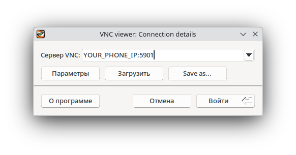

# OBoard 
### Интерактивная панель для вашего устройства с Termux!
<br>

# 1. Подготовка устройства
### 1.1. Установите Termux
Лучше скачивать его либо с [F-Droid](https://f-droid.org/ru/packages/com.termux/index.html) либо с [GitHub](https://github.com/termux/termux-app/releases), потому что в Google Play устарелая версия.

### 1.2. Установите proot-distro
`proot-distro` - это утилита в Termux для запуска Linux-дистрибутивов в отдельной от Android среде.

Чтобы установить ее напишите:
```bash
pkg update
pkg install proot-distro
```

### 1.3. Установите дистрибутив
Я рекомендую устанавливать **Debian** или **Ubuntu**, так как они мало весят, и довольно стабильны.

Выполните:
```bash
proot-distro install debian
# или любой другой дистрибутив, полный список можно посмотреть написав proot-distro list
```

### 1.4. Зайдите в ваш установленный дистрибутив
```bash
proot-distro login debian
```

### 1.5. Установите все необходимое
Для работы приложения необходим Python и curl, если он не установлен, установите.
```bash
apt update && apt upgrade -y
apt install python3 curl
```
Нужные библиотеки в Python:
```bash
pip install flask requests pyftpdlib
```
А также LXDE, tigervnc-server и git:
```bash
apt install lxde tigervnc-standalone-server git -y
```

# 2. Развертка OBoard

### 2.1. Настройка VNC, запуск LXDE и подключение через VNC Viewer на ПК
Настройте запуск LXDE:
```bash
mkdir -p ~/.vnc
echo -e '#!/bin/sh\nxrdb $HOME/.Xresources\nstartlxde &' > ~/.vnc/xstartup
chmod +x ~/.vnc/xstartup
```

Задайте пароль VNC:
```bash
vncserver :1
```

После завершите процесс VNC для применения пароля:
```bash
vncserver -kill :1
```

### 2.2. Запуск LXDE!
Запустите VNC сервер с LXDE под ваше разрешение:
```bash
vncserver :1 -geometry 2160x1080 -depth 24 -localhost no
```

``-localhost no`` - служит для того чтобы вы могли подключится к этому серверу с другого устройства.

### 2.3. Подключение с ПК, развертка OBoard
#### Если у вас **Linux**:
Скачивайте ``tigervnc-viewer``

```bash
sudo apt install tigervnc-viewer
```

После чего в Termux напишите команду ``ifconfig``, у вас будет примерно такой вывод:
```bash
eno1: flags=<...><UP,BROADCAST,RUNNING,MULTICAST>  mtu <...>
        inet 192.168.1.12 (ПРИМЕР)  netmask <...>  broadcast <...>
```
Вам нужен этот IP.
<br>
Запустите TigerVNC Viewer, вставьте ваш IP и напишите порт ``5901``


#### Если у вас **Windows**:
Скачайте **TigerVNC Viewer** с [официального сайта](https://sourceforge.net/projects/tigervnc/files/stable/).
Установите и запустите.
В поле *"VNC Server"* введите:

   ```
   <ваш-IP>:5901
   ```

Например: `192.168.1.12:5901`

Нажмите **Connect** — готово.

---

#### Если у вас **macOS**:
Установите через Homebrew:

   ```bash
   brew install tigervnc-viewer
   ```

   или скачайте `.dmg` с сайта TigerVNC.
Аналогично, вводите:

   ```
   <ваш-IP>:5901
   ```

---

*Важно:*
ПК и телефон должны быть **в одной Wi-Fi сети** (иначе VNC не подключится).

---
После подключения:

Откройте LXTerm, Склонируйте репозиторий:
```bash
git clone https://github.com/yaragirodev/oboard-project.git
```
